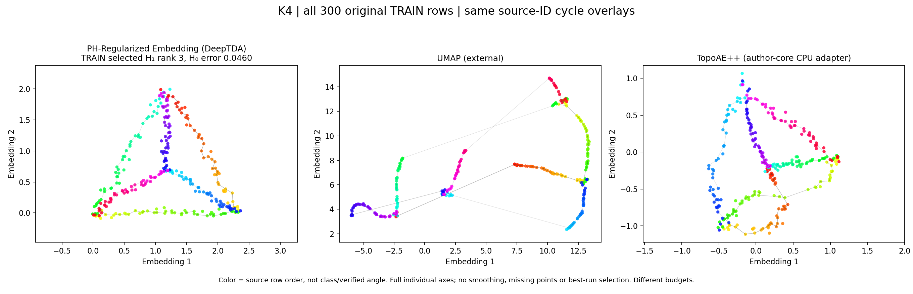
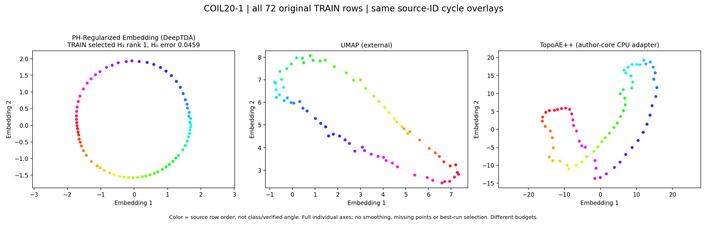
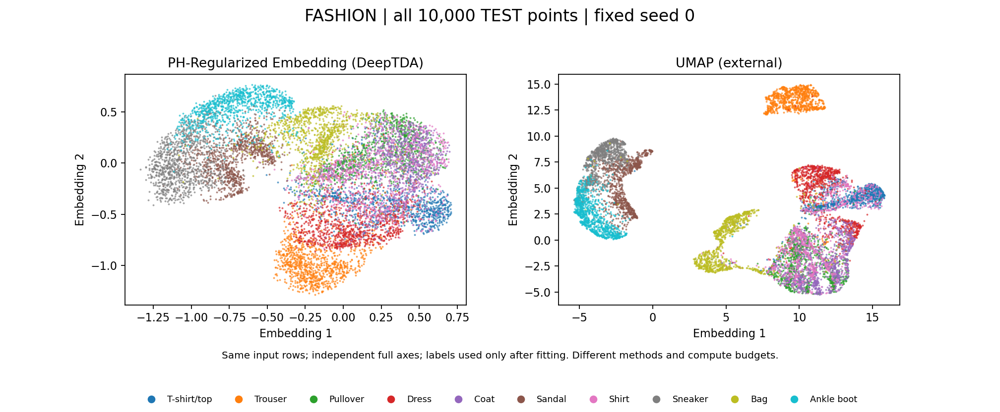
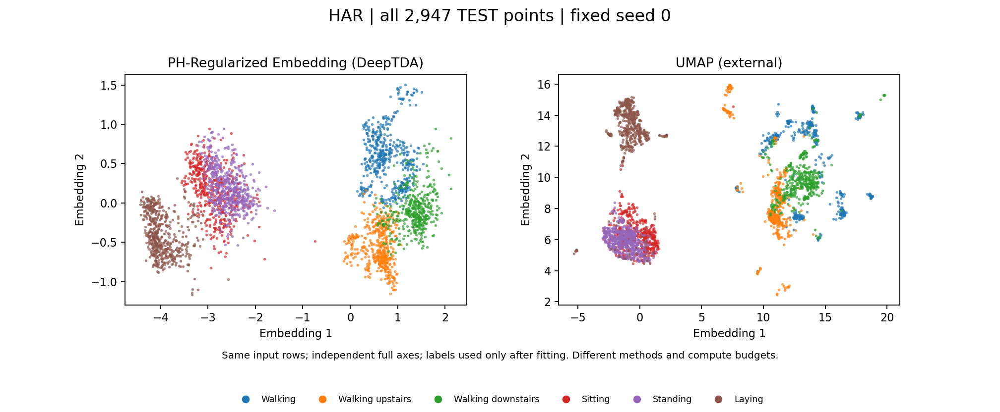
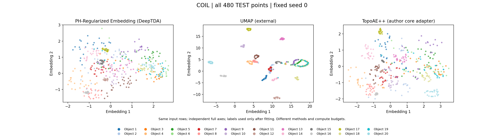

# PH-Regularized Embedding

[](https://github.com/roshameow/open-deep-tda/actions/workflows/ci.yml)
[](https://www.python.org/)
[](LICENSE)

[中文](README.zh-CN.md) · [Results](#results) · [Install](#install) · [Use](#use)

**PH-Regularized Embedding** is the working name for this project's **one topology-aware dimensionality-reduction algorithm**, exposed as `DeepTDA` in the current source. The repository/package identifiers remain `open-deep-tda` / `open_deep_tda` for now. This is an independent implementation, **not** DataRefiner's official Deep TDA or an exact reproduction.

The `DeepTDA` training objective combines reference-space geometry with sampled Vietoris–Rips H₀ and H₁ losses and source critical-edge constraints. Exact bounded PH runs in C++; the parametric reducer supports `transform`. For a **source-only, explicitly supplied cycle contract**, the opt-in `fit_with_topology_guidance` continues the same PH-trained model through a certified planar teacher. If the teacher alone does not pass the final gate, its default continuation can add full-TRAIN H₀ contacts and, when needed, exact F₂ filling cuts; a separate, full-row-rank-only option corrects the same MLP's affine head toward the certified teacher. Either path returns a layout only after **independent checks on every supplied TRAIN row**. Currently this bounded mode supports one simple selected cycle or a subdivided-K4 family, not arbitrary topology. Ordinary `fit` has no such certificate; neither method guarantees new-query topology or class separation.

## Results

All comparisons show the **PH-trained `DeepTDA`**, not a graph-only replacement. The **left panel** is this project's output; other panels are external implementations. Structure-specific figures show **all TRAIN rows** and fixed original-ID source-cycle edges; behavior figures show **all TEST rows** with post-fit class colors. Axes show each method's complete range, without cropped or deleted points.

### Source-cycle structure: PHRE versus UMAP and TopoAE++

On the author-provided **synthetic K4 300-point source**, an independently proposed three-cycle source family survives at a fixed source interval. The opt-in guided `DeepTDA` output independently retains **all three *same-ID* cycles (rank 3/3)** across all 300 points, with same-ID H₀ merge error **.046 ≤ .05**. UMAP and the separately adapted author TopoAE++ output receive the same raw input, but their coordinate units/compute differ; equal-looking target bars alone would not establish the same source-cycle certificate. Colors encode source row order, not classes.



**COIL20-1 is a different cohort from the COIL-20 classification experiment below:** all **72 views of one real object**, with one label-free source-selected cycle. Our guided PH-trained model retains that same-ID source cycle (**rank 1/1**) over all 72 supplied rows; complete-domain H₀ error is **.046 ≤ .05**. Color is original row order, **not a verified physical angle or a semantic class**. These are *transductive TRAIN* structural checks, not new-view or cattle-activity results.



UMAP has higher overlap@15 on K4 (**.868 vs our .821**) and COIL20-1 (**.848 vs our .816**); structure and neighborhood quality are separate. The COIL20-1 *row-order* two-neighbor diagnostic is 1.000 (ours), .861 (UMAP) and .972 (TopoAE++), **not verified angular recall**. All three are fixed seed-0, with unequal computation; the author-core CPU adapter is not the paper's best-of-ten figure. The selected source-cycle and H₀ certification covers only this project's declared input units/IDs, not all H₁ or a source-to-target chain isomorphism. **These figures do not isolate the causal contribution of the sampled H₁ loss:** the additional source-derived structural teacher and full-domain contacts are part of the opt-in method. [Audited scalar scope and limitations](benchmarks/results/ph_guided_selected_cycles.json).

### Behavior and object-class clustering: external comparison

#### Fashion-MNIST: PH-Regularized Embedding versus UMAP

60,000 fit / 10,000 test; identical train-fitted PCA64 input. Fixed seed-0 visualization:



#### HAR: PH-Regularized Embedding versus UMAP

Official subject-disjoint 7,352 fit / 2,947 test; same training-defined numeric reference:



#### COIL-20: PH-Regularized Embedding versus UMAP and TopoAE++

960 fit / 480 held-out views of seen objects; all three methods use the same ordered PCA64 inputs. TopoAE++ is a fixed seed-0 **author model/loss with an independent CPU training adapter** (1,000 updates), not an untouched paper pipeline or a best-of-ten figure. Training budgets and architectures are not equal.



KMeans is fit on each method's TRAIN embedding and evaluated on **all TEST rows** (class count follows each dataset). These TEST datasets were inspected during project development, so these are **descriptive fixed comparisons, not untouched prospective holdouts**. Three predeclared seeds, same inputs within each dataset:

| Dataset | PH-Regularized Embedding (`DeepTDA`) TEST ARI | External UMAP TEST ARI |
|---|---:|---:|
| Fashion-MNIST | .397 | **.471** |
| HAR | **.653** | .522 |
| COIL-20 | .391 | **.734** |

On COIL-20 alone, the separate one-seed comparison at seed 0 gives **.422** (`DeepTDA`), **.735** (UMAP) and **.527** (TopoAE++ adapter) under TRAIN-fitted KMeans (**20 clusters**, `n_init=10`, fixed seed). These one-seed scores are **not** the three-seed means above. ARI measures post-fit class organization, not source-cycle preservation. The guided TRAIN-only K4/COIL20-1 results above **do not change** these separate Fashion/HAR/COIL-20 clustering scores or imply general topology-preserving reduction. [Audited clustering records](benchmarks/results/phre_external_comparison.json).

## Install

Python 3.9+, a C++17 compiler and PyTorch are required:

```bash
git clone https://github.com/roshameow/open-deep-tda.git
cd open-deep-tda
python3 -m venv .venv
source .venv/bin/activate
python -m pip install --upgrade pip
python -m pip install -e .
```

Installation does not download benchmark datasets.

## Use

```python
from open_deep_tda import DeepTDA

model = DeepTDA(steps=200, h1_size=64)
Z_train = model.fit_transform(X_train)
Z_new = model.transform(X_new)  # no automatic topology guarantee for new rows
```

An optional **source-witness-guided fit** (not the ordinary default):

```python
model = DeepTDA(steps=200, h1_size=64, standardize=False,
                missing_indicators=False)
model.fit_with_topology_guidance(
    X_train, cycles=source_cycles, birth_radius=a, survival_radius=b,
    source_scale="median_all_pairs", h0_tolerance=0.05,
    strategy="single",  # "single_beam" for one cycle; "subdivided_k4" for three
)
Z_train = model.embedding_   # independently checked on every supplied TRAIN ID
Z_new = model.transform(X_new)  # requires separate new-population verification
```

For one simple cycle, `strategy="single_beam"` is an **explicit, bounded source-only candidate search** instead of the default greedy source teacher. With that strategy only, `teacher_realization="affine_min_norm"` optionally interpolates a certified teacher by correcting the **existing PH-trained MLP's affine head**; the default remains iterative `"adam"`. It refuses deficient/ill-conditioned TRAIN feature rows or an unrepresentable update. Every mode keeps the same independent all-TRAIN H₀/H₁ acceptance gate; exhausted work is an error, and none certifies new rows or isolates the causal contribution of native sampled H₁. `source_cycles`, `a` and `b` must be chosen **without labels or target coordinates**, in the declared TRAIN reference units; optionally use [`auto_global_witnesses`](python/open_deep_tda/structural_auto_witness.py) for one source class or [`auto_source_h1_family`](python/open_deep_tda/structural_auto_family.py) for three, with explicit `allow_external=True` and **Ripser in an isolated process**. This optional external solver has separate resource limitations. Unsupported source graph, exhausted budget or unresolved joint requirements are explicit errors: no unchecked embedding is returned. Input, model and witness files may be sensitive; do not publish them. The ordinary default uses a training-fitted reference, geometry stress and nonzero sampled H₀/H₁/critical-edge losses; sampling is **not** full-population PH. Training settings behind the figures are stated in their [structural](benchmarks/results/ph_guided_selected_cycles.json) and [clustering](benchmarks/results/phre_external_comparison.json) records. Saving a model does not anonymize it. A self-contained *analytic API check* (not a real-data benchmark) is available with `python examples/run_ph_guided.py`.

## Attribution and license

[TopoAE++](https://github.com/MClemot/TopologicalAutoencodersPlusPlus) and [UMAP](https://github.com/lmcinnes/umap) are independent external methods, not this project's implementations. Standard PH and topology-autoencoder ideas are attributed in [Third-party notices](THIRD_PARTY_NOTICES.md). Original project code is [MIT licensed](LICENSE).
