# Open Deep-TDA

[](https://github.com/roshameow/open-deep-tda/actions/workflows/ci.yml)
[](https://www.python.org/)
[](LICENSE)

**Inspectable dimensionality reduction: a new graph layout/query mapper, a reproducible PyTorch baseline, and explicit structural certificates.**

[中文说明](README.zh-CN.md) · [Quick start](#quick-start) · [Related projects](#related-projects) · [Benchmarks](#benchmarks)

> [!IMPORTANT]
> This is an independent experimental implementation inspired by public Deep-TDA ideas. It is **not** DataRefiner's official implementation, an exact reproduction, or a state-of-the-art claim. TopoAE and TopoAE++ are separate research projects and are used only as external references/baselines.

## Current acceptance status: clustering is not established

High 15-NN classification or local-neighbor scores **do not establish a usable cluster layout**. The query mapper also retrieves neighbors in the original feature space; its classification probe evaluates that whole system, not autonomous 2D cluster discovery. The historical accuracy headlines below are not a clustering acceptance result.

We now provide [matched author-data visual comparisons](benchmarks/visual_contracts/README.md), with raw scatters, failures and source-cycle checks. On K4, the fixed author TopoAE++ adapter retains three substantial bars while our current graph result retains one, despite our higher local-neighbor scores. This is a structural deficit. On matched Digits, both methods can split the same digit into islands; our additional merging/instability is not excused by that fact. The tested global-distance and long-edge-force alterations were not consistently successful and were **not promoted as new defaults**.

<p align="center">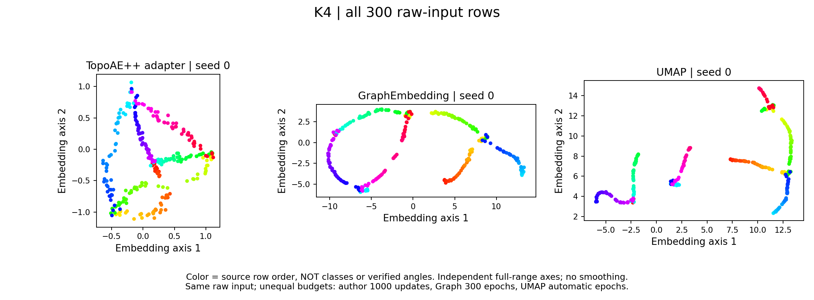</p>

## Local-neighbor and classification experiments (unreleased main)

`GraphEmbedding` replaces the PCA-residual training route with **component-aware spectral initialization → direct sparse-graph coordinate SGD → fixed-layout conditional query optimization within the TRAIN convex hull**. This is an independent implementation using standard graph/UMAP and conditional-embedding ideas, **not a new weighted-loss preset or a claim of mathematical novelty**. The legacy `DeepTDA` API remains unchanged for reproducibility.

Fixed official splits, seeds **0/1/2**, labels used only after fitting:

| Dataset | Prior configuration accuracy | Graph + conditional mapper | Author UMAP | Graph / UMAP neighbor overlap@15 |
|---|---:|---:|---:|---:|
| Fashion-MNIST | 69.21% | **78.49%** | 77.88% | **.1727** / .1442 |
| HAR | 82.21% | 83.02% | **83.38%** | **.1973** / .1550 |
| COIL-20 | 72.78% | **87.08%** | 85.14% | **.7899** / .7700 |

Accuracy is a post-fit 15-NN probe on **every official TEST row**. Geometry uses fixed queries against **all TRAIN references**, not a small candidate subcloud. All methods use matched reference features and audited neighbors. These are three-seed means from a new paired protocol—not substitutions for historical numbers. COIL's prior control is the documented 600-step stress setting, not the best possible competing method.

**Tradeoffs remain:** Fashion clustering ARI is .421 versus UMAP .471; HAR ARI falls .653→.534 relative to the prior configuration. The original full Fashion query stage takes about **142 seconds / 10,000 rows**, versus UMAP's 8 seconds; separately measured bounded refinement adds about .53 seconds. This is not a fresh end-to-end timing. Graph predictors retain all training features. Neighborhood gains do not establish universal clustering superiority. No test-dependent retuning, best-seed selection, or failed-query removal was used. Historical TEST use is disclosed; this is not virgin external validation.

The table uses the default **TRAIN-hull bounded mapper** follow-up, with all original layouts and comparison methods frozen. The original unbounded KL query objective could send finite outputs far from the training layout; success flags and small gradients did not prevent this. A fixed constrained optimization rule was checked on TRAIN-only cases before the follow-up: **430 of 40,281 official queries were refined, none removed; all inside-hull outputs stayed bitwise unchanged**. This is an interpolation assumption, not an out-of-distribution guarantee or post-hoc plot clipping. The historical mode remains available as `mapping_domain="unbounded"`.

[Bounded follow-up, all nine arms](benchmarks/results/graph_core_compact_confirmation.json) · [Original 30 records, including escape failures](benchmarks/results/graph_core_confirmation.json) · [Protocol and reproduction](benchmarks/graph_core/README.md)

<p align="center">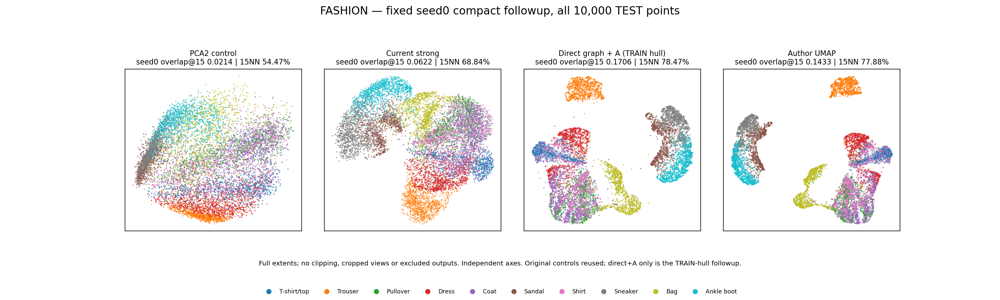</p>
<p align="center">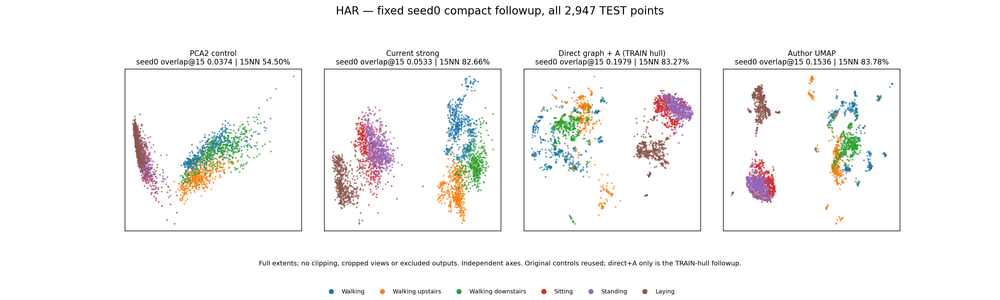</p>
<p align="center">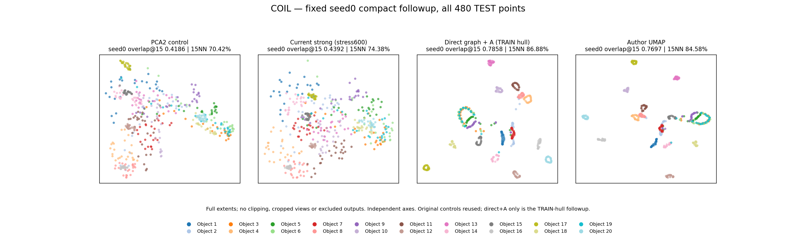</p>

The graph core itself **does not certify H₀/H₁ preservation**. A separate, explicitly requested structural construction is described below; it is not silently substituted into these benchmark results.

## Experimental image-reference option

For small grayscale-image sets, an explicit translation-tangent **dissimilarity** can discount limited pixel shifts without warping images or using labels. It is not a metric, exact image registration, or a generic vector-data default. Both our graph method and author UMAP benefit in the full-Digits prototype; fixed-split/held-out clustering remains mixed. This changes the input reference—not just the optimizer—and does not preserve the original pixel-space PH by implication.

```python
from open_deep_tda import TranslationTangentDissimilarity, PrecomputedGraphEmbedding

reference = TranslationTangentDissimilarity()
D = reference.fit_transform(images)  # grayscale (N,H,W), explicit dense budgets
reducer = PrecomputedGraphEmbedding()
Z = reducer.fit_transform(D)
Y = reducer.transform(reference.transform(new_images))
```

```bash
python examples/digits_image_geometry.py --umap
```

The current public seed-0 all-1,797 integration run has KMeans10 ARI **.822→.848** for our graph and **.822→.904** for author UMAP. This is an illustrative transductive result, **not “clustering fixed,” a held-out result, or our optimizer beating UMAP**. Earlier prototype seed gains must not be substituted for current API scores; all mixed results and numerical changes are [recorded separately](benchmarks/results/image_reference_diagnostic.json). The default dense domain is at most 2,000 reference images; no large-image-population speed or generalization claim is made. The graph adapter expects exact TRAIN-column identity in query distance matrices and does not silently use Euclidean distances between distance profiles. It provides no checkpoint persistence API.

<p align="center">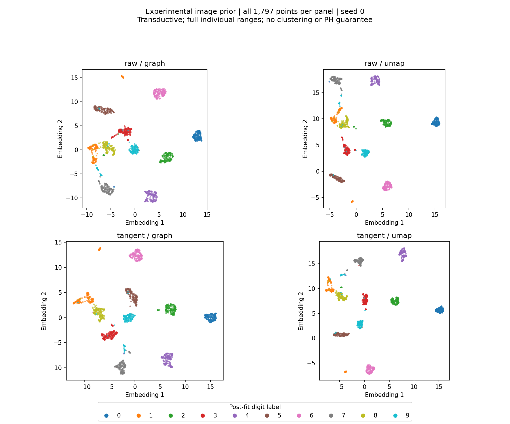</p>

## Structural contracts and constructive layouts

Structural acceptance is separate from optimization success. The original checks remain available, and the new sparse and constructive paths operate on **every supplied row**, without silently sampling.

- [`compare_h0`](python/open_deep_tda/structural_h0.py) computes global MSTs on **all supplied rows** and checks the exact maximum error of same-ID component merge distances. It distinguishes the actual hierarchy error from the more conservative MST-edge error bound.
- [`check_h1_witnesses`](python/open_deep_tda/structural_h1.py) checks explicitly supplied source cycle representatives over a declared radius interval. Target cycles must retain their edges, remain nonboundaries, and remain independent. Triangles involving *other supplied vertices* count as possible fillings.
- Budget exhaustion raises an error, never a passing partial certificate. H₀ accepts bounded dense matrices (default limit 2,048 vertices); the exact H₁ prototype has a hard limit of 128 vertices. Neither silently subsamples nor certifies an omitted population. The H₁ checker is not a full-complex chain-map/isomorphism certificate or an automatic source-cycle selector.

Run the analytic acceptance cases:

```bash
python examples/check_structural_contracts.py
```

The intact square passes; missing cycles, identical barcodes with wrong row correspondence, filling by an extra vertex, merging two independent classes, and an incorrect global bridge are rejected. These are **correctness gates, not real-data quality benchmarks**. They do not by themselves establish dimensionality-reduction quality or successful out-of-sample structure preservation.

### Full-domain constructive path

- [`analyze_sparse_h1`](python/open_deep_tda/structural_sparse_h1.py) uses a sparse survival-edge coordinate space and streamed triangle reduction. Its bounded domain reaches **1,024 vertices**, without discarding other vertices that might fill a cycle.
- [`auto_global_witnesses`](python/open_deep_tda/structural_auto_witness.py) proposes a global source class through optional author Ripser, then checks it independently. External-solver execution requires explicit consent; its internal resources are not covered by the core budgets.
- [`construct_global_layout`](python/open_deep_tda/structural_constructive.py) builds a cycle scaffold first, then inserts remaining vertices through hierarchy-compatible contacts. It returns coordinates **only after full-domain H₀ and H₁ checks pass**. Currently it supports one simple selected cycle and can fail on valid inputs.
- [`structural_planar.certify`](python/open_deep_tda/structural_planar.py) checks all vertices against protected empty disks and exact F₂ winding. It supplies a scalable sufficient target certificate in real represented-float64 geometry, **not exact equivalence to rounded `pdist` filtrations**, and does not validate the source by itself.

On **all 960 COIL training rows**, a label-free globally selected class survives; the constructed layout has same-ID H₀ merge error **.049 ≤ .05**, and independently verified H₁ rank **1**. This concerns the complete supplied training domain, not just cycle vertices or a 48-row subcloud. It certifies selected-class survival—not all H₁, precise death times, barcode equality, or semantic labels.

There is a genuine tradeoff: training overlap@15 falls **.769→.571** relative to its unconstrained graph guide. A separate, fixed seed-0 induction ablation obtains **93.54%** classification accuracy versus its matched exact-neighbor graph guide's **88.75%**, but TEST overlap falls **.7833→.5908**. This is **not** the shared-ANN three-seed benchmark above. After adding all 480 mapped TEST rows, selected target H₁ still passes, but full 1,440-row H₀ error is **1.5295**: **the .05 out-of-sample H₀ requirement fails**. The hole guard moves zero queries; no gain is attributed to it.

Earlier constructive transfer trials also failed: the first rule certified 0/6 new small cohorts, and a frontier extension 1/6. Those results remain evidence against a general feasibility claim. The recorded 960-row success was reproduced in the matched runtime; a newer-runtime construction was unsupported and is also retained. [Outcomes and scope](benchmarks/results/global_structural_diagnostic.json) · [Reproducer](benchmarks/validate_global_structural.py)

```bash
python examples/construct_global_layout.py
```

Use `GraphEmbedding.from_layout(X, checked_layout)` to configure the same query mapper around externally constructed coordinates. This factory **does not transfer a training certificate to new queries** or certify arbitrary supplied layouts.

<details>
<summary>Earlier filling-cut repair experiments and their failed joint cases</summary>

### Certificate-guided layout repair prototype

- [`select_h1_witnesses`](python/open_deep_tda/structural_witnesses.py) selects independent source cycles over a specified interval without labels. It reports the full interval-image rank even when the returned family is capped.
- [`find_h1_obstructions`](python/open_deep_tda/structural_obstructions.py) returns explicit filling triangles or relations merging selected classes. Each certificate's F₂ boundary is verified.
- [`dual_h1_certificate`](python/open_deep_tda/structural_dual.py) constructs source dual cocycles. These detect target triangles incompatible with a sufficient certificate for the selected classes, so the solver need not eliminate one filling at a time. This is sufficient, not necessary, and is not a whole-complex isomorphism proof.
- [`solve_structural_layout`](python/open_deep_tda/structural_dual_layout.py) batches source-consistent separation cuts and uses adaptive reference-hierarchy merge edges for optional H₀ constraints. SLSQP proposes coordinates; **only independent structural verification accepts them**. A failed search returns `embedding=None`, never a claimed solution or proof of infeasibility.

```bash
python examples/repair_structural_layout.py
```

The analytic cases now actually repair missing cycles, external fillings, merged classes and wrong connectivity, not merely detect them. This is a **maximum-64-vertex, explicit-contract, direct-coordinate prototype**: no learned `transform`, large-data claim, semantic guarantee, or performance upgrade is implied. Its objective is minimal displacement from a supplied layout, not a complete neighborhood-visualization objective. The older single-filling [`repair_layout`](python/open_deep_tda/structural_layout.py) remains an experimental reference, not the recommended core path.

#### Small real-data repair diagnostics — joint preservation still fails

Fixed TRAIN-only checks use 48 COIL-20 training views of the first object and 48 label-blind Fashion training rows. Source intervals/classes are derived from the reference alone. These are **small supplied-domain diagnostics, not full-dataset or classification benchmarks**.

| Case | One-filling-at-a-time H₁ repair | Dual-batch H₁-only repair | Dual H₀+H₁ (H₀ tolerance 0.05) |
|---|---|---|---|
| COIL-20, 48 rows | Unresolved after 48 rounds | Certified in 1 round | **Unresolved** |
| Fashion, 48 rows | Unresolved after 48 rounds | Certified in 1 round | **Unresolved** |

The joint failed candidates have H₀ errors about **4.94 / 659.55**, and do not preserve the required H₁ class. No certified embedding is returned for them. This is a solver failure, **not a proof that the requested planar structure is impossible**. This joint SLSQP route remains an unsuccessful experimental reference; it is not the new graph reducer or the constructive path above. [All eight outcomes and source hashes](benchmarks/results/structural_repair_diagnostic.json) are retained; raw coordinates/logs stay local. Reproduce with [`validate_structural_repair.py`](benchmarks/validate_structural_repair.py), separate `--output` directories, and `--solver sequential` / `--solver dual`; register before running. The original sequential snapshot is commit `62b4aeb`, and the measured public dual snapshot is `4c643dd`.

</details>

## Features

- C++17 Vietoris–Rips **H₀/H₁ over F₂**, deterministic MST and critical-edge output.
- Explicit simplex, reduction-entry, reduction-operation and matching budgets; failures are never presented as partial success.
- New 2D graph-coordinate optimizer with independent conditional-query `transform`.
- Preserved legacy 2D/3D PyTorch mapping with PCA initialization.
- Distance-stress geometry, optional experimental fuzzy-neighbor geometry, H₀/H₁ and critical-edge objectives.
- Exact blocked neighbors or isolated NN-descent with an exact recall audit.
- Online topology subcloud refresh and measured sample-coverage diagnostics.
- Legacy neural compact checkpoints can omit training rows; graph NPZ predictors necessarily retain them.
- Offline HTML/SVG reports, persistence diagrams, Mapper summaries and CLI tools.

> [!NOTE]
> The legacy neural trainer computes PH on **selected small subclouds**, not the entire large population. New structural APIs state their complete supplied-domain limits separately. Similar persistence diagrams do not guarantee semantic correspondence or physically correct cycle order.

For the new graph route, use `GraphEmbedding` (install the `graph` extra). For historical neural experiments, the [Fashion-MNIST PCA64 NCE preset](configs/fashion-pca64-nce.json) and [HAR graph preset](configs/har-neighborhood.json) remain available. These are dataset-specific experiments, not universal defaults; the HAR NCE transfer was unsuccessful.

## Historical parametric visual examples

<p align="center">
  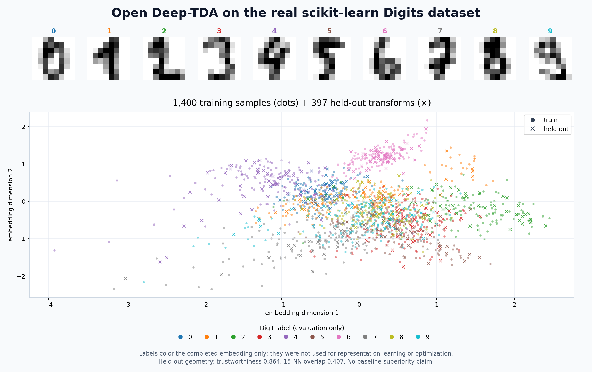
</p>

This figure uses the real bundled scikit-learn Digits dataset: 1,400 training rows and 397 held-out rows mapped with `transform`. Dots are training samples, `×` marks held-out samples, and colors are digit labels used **only after training**. Held-out trustworthiness is 0.864 and 15-neighbor overlap is 0.407. The figure demonstrates out-of-sample behavior; it does not claim superiority over another method.

### Additional real-data examples

These earlier configurations are retained for transparency. See the [paired graph results](#unreleased-neighborhood-optimization-fixed-confirmation) and [latest NCE results](#fixed-full-data-nce-confirmation) below rather than treating these pictures as the best available configuration.

#### UCI Human Activity Recognition

<p align="center">
  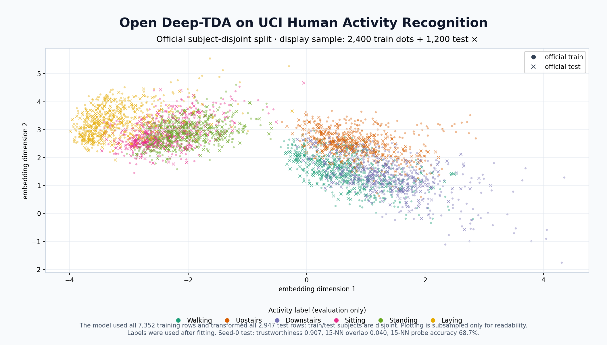
</p>

The model used all **7,352 official training rows** and transformed all **2,947 test rows**; train and test subjects are disjoint. The plot uses a stratified display subset for readability. Activity labels are evaluation-only. Seed-0 test diagnostics are trustworthiness **0.907**, 15-NN overlap **0.040**, and post-fit 15-NN probe accuracy **68.7%**.

#### Fashion-MNIST

<p align="center">
  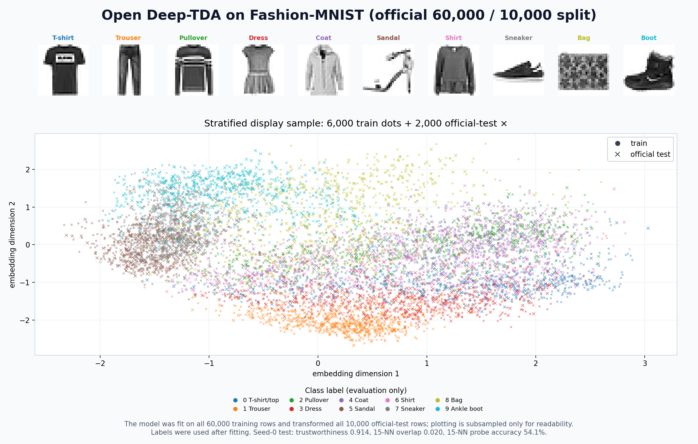
</p>

The model was fit on all **60,000 training images** and transformed all **10,000 official test images**. Only the rendered plot is stratified-subsampled. Labels are used after fitting. Seed-0 test diagnostics are trustworthiness **0.914**, 15-NN overlap **0.020**, and post-fit 15-NN probe accuracy **54.1%**.

These are fixed-run visualizations, not selected best seeds. The low neighborhood overlaps and class mixing are intentionally visible; the figures are evidence of actual behavior, not marketing illustrations. Dataset attribution and redistribution terms are listed in [THIRD_PARTY_NOTICES.md](THIRD_PARTY_NOTICES.md).

## Installation

Requirements: Python 3.9+, PyTorch 2.6+, and a C++17 compiler.

```bash
git clone https://github.com/roshameow/open-deep-tda.git
cd open-deep-tda
python3 -m venv .venv
source .venv/bin/activate
python -m pip install --upgrade pip
python -m pip install -e .
```

Optional dependencies:

```bash
python -m pip install -e '.[dev]'              # tests and PH oracles
python -m pip install -e '.[ann]'              # NN-descent
python -m pip install -e '.[graph,plot]'       # new graph core and figures
python -m pip install -e '.[benchmark,images]' # benchmark tooling
```

Installation does not download datasets or contact a training service. Real datasets are explicit opt-in downloads and remain outside the repository.

## Quick start

The new API is on **unreleased main**, not the older v0.3 prerelease artifact:

```python
from open_deep_tda import GraphEmbedding

model = GraphEmbedding(neighbor_backend="exact", seed=0)
Z_train = model.fit_transform(X_train)
Z_new, diagnostics = model.transform(X_new, return_diagnostics=True)
# Large training sets can explicitly select neighbor_backend="pynndescent".
# The mapper retains every training feature row; finite nonconvergences are reported.
model.save("graph-predictor.npz")  # data-bearing, not compact/anonymized
restored = GraphEmbedding.load("graph-predictor.npz")
```

No preprocessing is silently fitted: pass the same finite feature representation to fit and transform. Fixed source15 neighborhoods require at least 16 training rows. Query optimization always treats a row as a new query, even if it matches training features; it is not exact anchor interpolation. The default domain is the TRAIN convex hull; constrained/nonconverged phases are reported. Older graph checkpoints retain their historical unbounded policy rather than silently changing predictions. Default scratch files are deleted; raw debug retention requires explicit opt-in. Safe NPZ checkpoints do not serialize external query-index objects.

```bash
python examples/run_graph_embedding.py --plot
# Numeric arrays; output directories/checkpoints remain private:
deep-tda graph-fit --input train.npy --validation test.npy --output outputs/graph-run
deep-tda graph-transform --model outputs/graph-run/model.npz --input new.npy --output outputs/graph-new.npy
```

### Legacy parametric baseline


```bash
deep-tda demo --dataset circle --samples 256 --features 8 \
  --config configs/quick.json --output outputs/demo
```

Open `outputs/demo/report.html` locally.

```python
from open_deep_tda import DeepTDA
from open_deep_tda.datasets import make_dataset

X, _ = make_dataset("circle", n_samples=256, n_features=8, seed=7)
model = DeepTDA(steps=100, h1_size=32, evaluation_size=32)
Z_train = model.fit_transform(X[:200], validation_data=X[200:])
Z_new = model.transform(X[200:])

# Inference-only artifact: omits training rows and detailed reports.
model.save("model.pt", include_training_data=False)
restored = DeepTDA.load("model.pt")
```

Numeric NPY/NPZ/CSV input is also supported:

```bash
deep-tda fit --input train.npy --validation test.npy --output outputs/run
deep-tda transform --model outputs/run/model.pt \
  --input new.npy --output outputs/new-embedding.npy
```

CLI run directories can contain input arrays, embeddings and full checkpoints. Keep them private when needed. Compact checkpoints are smaller, but learned weights and preprocessing statistics remain data-derived; this is **not anonymization or differential privacy**.

## Geometry modes

Distance stress remains the default:

```python
DeepTDA(geometry_objective="stress")
```

The fuzzy-neighbor objective is opt-in:

```python
DeepTDA(geometry_objective="fuzzy", fuzzy_repulsion=1.0)
```

It independently implements established local-affinity/fuzzy-union ideas; it is not exact ParametricUMAP. In the fixed HAR confirmation, it improved neighborhood overlap and label-probe accuracy but substantially worsened raw-scale H₁ cost. It therefore remains experimental and is not silently selected as a better topology method.

### Neighborhood-oriented graph objective

`geometry_objective="fuzzy_graph"` replaces fuzzy edge cross-entropy with **weighted neighbor attraction plus sampled nonedge repulsion**. Weak graph edges are no longer explicitly repelled by the positive-edge loss. Attraction is normalized within each sampled batch; this is not an unbiased whole-graph ratio estimator or exact UMAP.

```python
model = DeepTDA(
    geometry_objective="fuzzy_graph", fuzzy_repulsion=1.0,
    lambda_h0=0.1, lambda_h1=0.01, steps=2400,
)
```

`residual_input_scale` optionally conditions only the neural residual's input (default `1.0`). It does **not** rescale the reference metric, PCA skip, or PH targets. The dimension-based scale tested below is a dataset-specific experiment, not a universal recommendation. Existing defaults and legacy checkpoint behavior remain unchanged.

### Conditional neighbor objective

`geometry_objective="neighbor_nce"` compares each sampled neighbor with multiple **nonneighbors of the same anchor** using Cauchy-kernel logits and a conditional softmax loss. Self-pairs, source graph edges and duplicate-input negatives are excluded. The selected setup uses 16 random candidates, temperature 1, and **no hard mining**; hard mining did not win the TRAIN-only search. This is an independently implemented sampled objective, not exact t-SNE, UMAP, or proprietary Deep TDA.

`output_calibration="train_pairs"` optionally fits a single positive output scale on up to 20,000 **TRAIN-only** pairs after optimization. It changes units, not neighbor ranking or clustering capability. Saved checkpoints retain the scale. Raw uncalibrated PH results remain available alongside calibrated results; calibration is not evidence of better topology shape.

## Benchmarks

Reviewed aggregate outputs are committed under [`benchmarks/results/`](benchmarks/results/); datasets, trained models, embeddings and raw machine logs are not.

Historical stress-based benchmarks (not the new graph presets):

| Protocol | Open Deep-TDA | External comparison | Honest interpretation |
|---|---:|---:|---|
| UCI HAR, official subject split | 67.78% mean test 15-NN | UMAP 86.17%; author TopoAE 75.88% | Current configuration did not beat mature baselines. |
| COIL-20, held-out views of seen objects | 72.78% accuracy; 42.57% angle adjacency | UMAP 86.46%; author TopoAE 82.08% | Strong H₁ bars did not ensure correct physical cycle order. |
| Fashion-MNIST, train-fitted PCA64 | 53.90% accuracy | UMAP 77.85%; author TopoAE 64.89% | This is not end-to-end image self-supervision. |
| TopoAE++ author core, COIL-20 | — | 81.04% accuracy; one seed | Real external core with disclosed adapters, not an untouched paper reproduction. |

Architectures and compute are not matched. Test labels are used only for final probes. See the JSON records and benchmark scripts for seeds, protocols and sampling fields.

### Why the earlier embeddings were weak

- **Distance matching is not neighbor ranking.** The stress/hinge objective can be zero even when nearest-neighbor identities are wrong; a regression counterexample is in [`tests/test_geometry_objective_limits.py`](tests/test_geometry_objective_limits.py).
- **Weak correction of false neighbors.** Uniform nonedge samples usually miss the confusing near pairs, and the hinge stops pushing once its global margin is satisfied.
- **Competing objectives.** In the earlier HAR/Fashion logs, H₀ embedding-gradient norms substantially exceeded the neighborhood term. This shows an imbalance, not proof that topology is always harmful.
- **More steps alone were insufficient.** On a fixed subject-held-out split within HAR TRAIN, stress overlap changed from **0.0617 → 0.0659** at 600 versus 2,400 steps. Graph + weak topology reached **0.0966**; residual conditioning reached **0.0987**. No labels or official TEST rows were used in these two development searches.

The complete candidate sets, including unsuccessful variants, are reproducible through [`benchmarks/optimize_geometry.py`](benchmarks/optimize_geometry.py) and [`benchmarks/optimize_residual_scale.py`](benchmarks/optimize_residual_scale.py). Each requires `--preregister` before `--run`; use separate `--output` directories. These are reused development data, not fresh generalization evidence.

### Unreleased neighborhood optimization: fixed confirmation

<p align="center">
  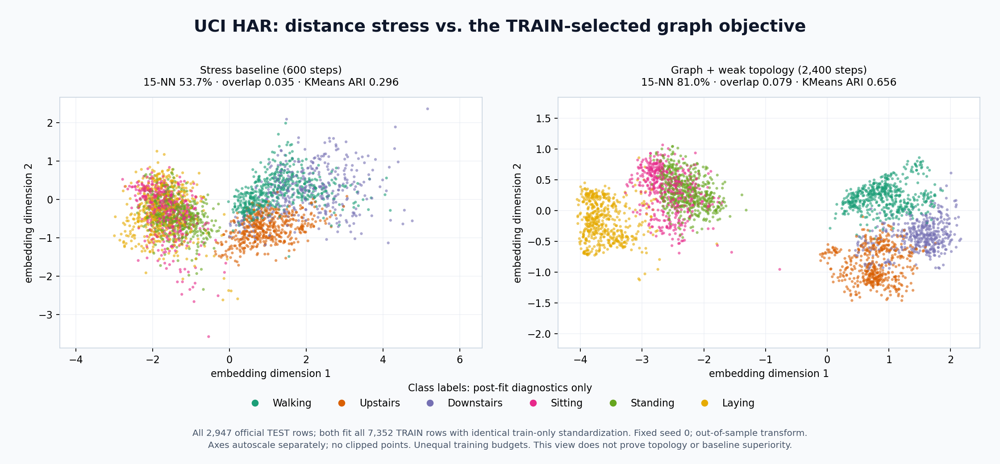
</p>

**HAR, three fixed seeds:** test 15-NN accuracy **58.23% → 82.55%**, population 15-NN overlap **0.0380 → 0.0775**, and KMeans test ARI **0.314 → 0.685**. KMeans on the standardized 561-dimensional reference gives ARI **0.437**. Raw normalized H₁ cost on three fixed 64-point test subclouds decreases **0.002291 → 0.000901**; PCA still has a smaller raw H₁ cost (**0.000243**).

Both arms here use the same **train-fitted feature standardization**, unlike the older HAR table above; the 58.23% control is a new paired baseline, not a replacement for the historical 67.78% result. All 7,352 training / 2,947 test rows are used. The image shows seed 0; numbers in this paragraph are three-seed means. Query metrics use 256 fixed test queries against the full train+test population.

The selected configuration was frozen using only internal TRAIN validation. The no-topology control is slightly better on HAR test overlap/accuracy, so these results **do not establish added value from topology regularization**. The gain is primarily a geometry/optimization result. We retain the preselected weak-topology model rather than switching based on TEST results. Training budgets differ (600 versus 2,400 steps); reused official test data are not an untouched external validation set.

Exact HAR settings: [`configs/har-neighborhood.json`](configs/har-neighborhood.json). All arms, seeds, raw/aligned PH and uncertainty summaries: [`geometry_optimization_har.json`](benchmarks/results/geometry_optimization_har.json). Reproduce with [`confirm_geometry_optimization.py`](benchmarks/confirm_geometry_optimization.py); pass `--conditioning-pilot` for the second development stage, and use identical options for registration/run. Render all test rows with [`render_geometry_comparison.py`](benchmarks/render_geometry_comparison.py).

#### Direct transfer to Fashion-MNIST — no Fashion tuning

<p align="center">
  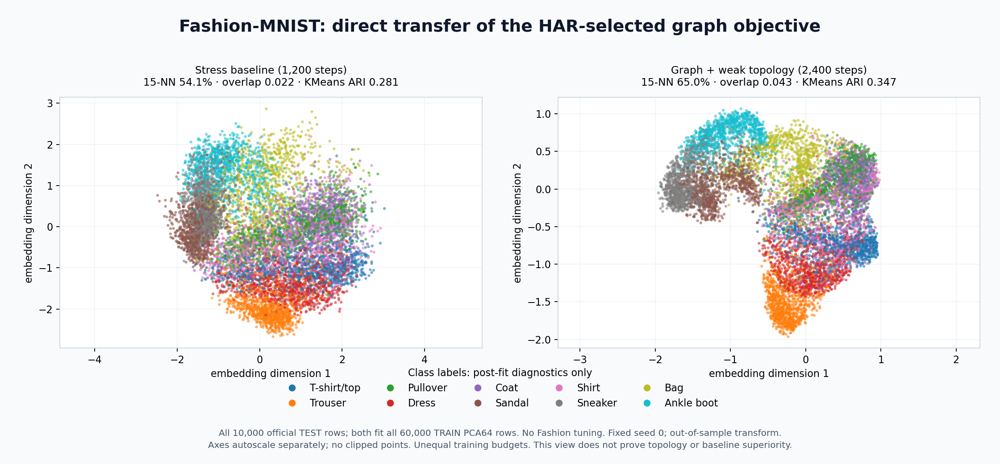
</p>

On the complete **60,000/10,000 PCA64 protocol**, three-seed test 15-NN accuracy improves **53.90% → 64.67%**, overlap **0.0230 → 0.0431**, KMeans ARI **0.281 → 0.366**, and raw normalized subcloud H₁ cost **0.009057 → 0.002009**. Direct PCA64 KMeans gives ARI **0.359**: the new 2D representation is competitive in this bounded clustering check, not decisively superior. Its classification accuracy remains below the earlier UMAP result (77.85%; unequal protocols/compute), and the unchanged PCA64 reference retains 85.77% probe accuracy.

The HAR-selected graph/weights were transferred without searching Fashion settings; residual scaling follows the same dimension-only rule (`sqrt(64)=8`). Training steps increase from 1,200 to 2,400. All ANN graphs passed the independent exact recall audit. Original arrays/checkpoints remain private.

Use [`configs/fashion-pca64-neighborhood.json`](configs/fashion-pca64-neighborhood.json) **on the benchmark's train-fitted PCA64 features**, not raw pixels. Full records: [`geometry_optimization_fashion.json`](benchmarks/results/geometry_optimization_fashion.json). Reproduction: [`confirm_geometry_fashion.py`](benchmarks/confirm_geometry_fashion.py); default input paths refer to local benchmark outputs, not bundled data. Run `render_geometry_comparison.py --dataset fashion_mnist` for the figure.

> [!WARNING]
> Better clustering is **not** better topology across the board. Raw normalized H₀ cost increases **0.0594 → 0.1144 (HAR)** and **0.0265 → 0.0770 (Fashion)**. The fraction of long source H₁ bars left unmatched rises **61.1% → 83.9%** and **27.8% → 51.7%**, respectively. A smaller diagram cost can coexist with losing more meaningful bars. These are fixed-subcloud diagnostics, not population-wide topology guarantees. The graph presets are therefore opt-in; the stress default is unchanged.

### Conditional-neighbor development study

A new label-free Fashion TRAIN split uses **50,000 fit / 10,000 validation images**. PCA64 is refit only on the fitting fold; no official TEST images or class labels are read. At 2,400 steps, validation overlap is **0.0458 (previous graph)** versus **0.0557 (neighbor NCE)**. At 7,200 steps it is **0.0565 versus 0.0677**. Hard-negative mining and temperature 0.5 performed worse; every candidate is retained in [`neighbor_nce_pilot.json`](benchmarks/results/neighbor_nce_pilot.json).

Positive-edge coverage is now reported separately from sample coverage: seeing every training row covered only about **66.6% of graph edges at 2,400 steps**, versus **96.3% at 7,200 steps** in this study. NCE also evaluates more negatives and costs more per step, so this is not a compute-matched speed claim.

Reproduce the registered search with [`optimize_neighbor_nce.py`](benchmarks/optimize_neighbor_nce.py); full-data confirmation is handled by [`confirm_neighbor_nce.py`](benchmarks/confirm_neighbor_nce.py). Both require `--preregister` before `--run` and use local ignored data/output directories. Models, raw arrays and private `docs/` are not published.

#### Fixed full-data NCE confirmation

<p align="center">
  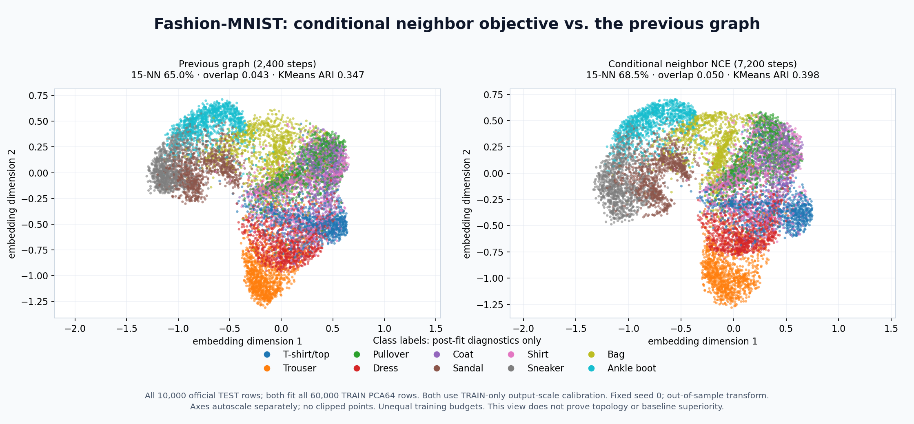
</p>

**Fashion-MNIST, three fixed seeds:** the previous graph's test 15-NN accuracy **64.67% → 68.55%**, overlap **0.0431 → 0.0565**, KMeans ARI **0.366 → 0.404**, and NMI **0.529 → 0.556**. Every run fits all 60,000 training rows and transforms all 10,000 test rows. The image uses seed 0; these numbers are three-seed means. This is a further improvement, but still below the earlier UMAP probe result, not SOTA.

The selected NCE configuration uses 7,200 steps versus the prior 2,400; mean fitting time in this run was about 188 versus 58 seconds. Both outputs use the same TRAIN-only calibration rule. Calibration does not earn credit for the neighborhood/classification gains. Uncalibrated H₁ cost worsens **0.002009 → 0.046404**; calibrated cost is approximately **0.00208 → 0.00205**, but **92.8% of long source H₁ bars remain unmatched** in the selected model's fixed subcloud diagnostics. Topology preservation is still not solved.

Preset: [`configs/fashion-pca64-nce.json`](configs/fashion-pca64-nce.json), for the benchmark's train-fitted PCA64 inputs. All per-seed metrics and calibrated/uncalibrated PH: [`neighbor_nce_fashion.json`](benchmarks/results/neighbor_nce_fashion.json). No TEST-based reselection; this is reused benchmark data, not independent fresh generalization evidence.

#### HAR transfer did not improve clustering

<p align="center">
  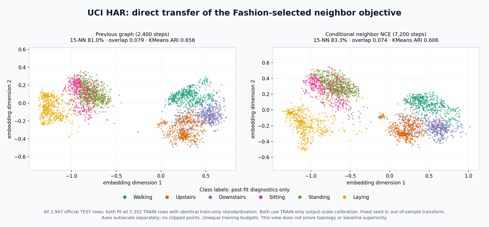
</p>

Transferring the frozen Fashion-selected configuration to HAR gives three-seed accuracy **82.55% → 82.46%**, overlap **0.0775 → 0.0797**, but KMeans ARI **0.685 → 0.614** and NMI **0.757 → 0.706**. Trustworthiness also decreases. The seed-0 image is not a substitute for these all-seed results. **This is not a recommended HAR upgrade**; keep the previous HAR preset rather than assuming the new objective is universally better.

Calibrated H₁ cost also increases **0.000249 → 0.000399**, with 100% long source H₁ bars unmatched in both arms' fixed diagnostic subclouds. No alternative was selected using HAR TEST. Full negative results: [`neighbor_nce_har.json`](benchmarks/results/neighbor_nce_har.json); the explicitly named [`har-nce-transfer-control.json`](configs/har-nce-transfer-control.json) exists for reproduction, not as a new default.

### Measured v0.3 engineering changes

- A positive-H₁-only serialization path keeps the same filtration/reduction. In one warm 128-point CPU measurement, cached H₁ loss plus backward changed from **166.8 ms to 117.7 ms**. It does not reduce worst-case native PH complexity.
- One same-model inference artifact changed from **15,971,797 bytes to 75,217 bytes** by omitting training data; reloaded predictions matched in that run.
- Fixed three-seed HAR geometry confirmation: fuzzy/no-topology achieved 0.03828 overlap and 60.24% probe accuracy versus 0.03220 and 53.01% for stress/no-topology, while raw normalized H₁ cost became roughly 10× worse.

These are bounded measurements, not universal performance guarantees.

## Related projects

| Project | Relationship to this repository |
|---|---|
| [DataRefiner Deep TDA article](https://medium.com/@juanc.olamendy/deep-tda-a-new-dimensionality-reduction-algorithm-2d04fa6ed2eb) | Inspiration only; no proprietary implementation was available or copied. |
| [BorgwardtLab/topological-autoencoders](https://github.com/BorgwardtLab/topological-autoencoders) | Original Topological Autoencoders implementation; separate method and external baseline. |
| [MClemot/TopologicalAutoencodersPlusPlus](https://github.com/MClemot/TopologicalAutoencodersPlusPlus) | H₁/cascade-based follow-up; separate author implementation, not “official Deep TDA.” |
| [danchern97/RTD_AE](https://github.com/danchern97/RTD_AE) | Representation Topology Divergence autoencoder; different cross-complex objective. |
| [harishd10/TopoMap](https://github.com/harishd10/TopoMap) / [VIDA-NYU/TopoMap-pp](https://github.com/VIDA-NYU/TopoMap-pp) | H₀-oriented topology-preserving layout methods, not this neural H₁ objective. |
| [aidos-lab/pytorch-topological](https://github.com/aidos-lab/pytorch-topological) | General PyTorch topology layers/losses; not a DataRefiner reproduction. |

Please cite the original projects when using or comparing their methods. Their licenses and dataset permissions are independent of this repository's MIT license.

## Development

```bash
python -m pip install -e '.[dev]'
python -m pytest -q

cmake -S . -B build/native -DCMAKE_BUILD_TYPE=Release \
  -DOPEN_DEEP_TDA_BUILD_PYTHON=ON \
  -DPython_EXECUTABLE="$(command -v python)"
cmake --build build/native --parallel 2
ctest --test-dir build/native --output-on-failure
```

CI runs on Ubuntu/macOS with Python 3.9/3.12 and checks Python tests, C++ tests, source/wheel contents, and installed-wheel inference. Optional external adapters are not required by ordinary CI.

## License

Original project code is [MIT licensed](LICENSE). Dependencies, external methods and datasets retain their own terms; see [THIRD_PARTY_NOTICES.md](THIRD_PARTY_NOTICES.md). No proprietary DataRefiner code or upstream TopoAE/TTK source is vendored.

Security and private-data reporting: [SECURITY.md](SECURITY.md). Contributions: [CONTRIBUTING.md](CONTRIBUTING.md).
