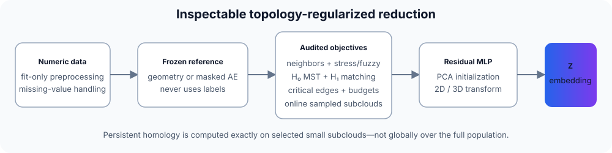

# Open Deep-TDA

[](https://github.com/roshameow/open-deep-tda/actions/workflows/ci.yml)
[](https://www.python.org/)
[](LICENSE)

**Inspectable topology-regularized dimensionality reduction with a C++ persistent-homology core and a PyTorch parametric embedding.**

[中文说明](README.zh-CN.md) · [Quick start](#quick-start) · [Related projects](#related-projects) · [Benchmarks](#benchmarks)

> [!IMPORTANT]
> This is an independent experimental implementation inspired by public Deep-TDA ideas. It is **not** DataRefiner's official implementation, an exact reproduction, or a state-of-the-art claim. TopoAE and TopoAE++ are separate research projects and are used only as external references/baselines.

<p align="center">
  
</p>

## Features

- C++17 Vietoris–Rips **H₀/H₁ over F₂**, deterministic MST and critical-edge output.
- Explicit simplex, reduction-entry, reduction-operation and matching budgets; failures are never presented as partial success.
- Parametric 2D/3D PyTorch mapping with PCA initialization and out-of-sample `transform`.
- Distance-stress geometry, optional experimental fuzzy-neighbor geometry, H₀/H₁ and critical-edge objectives.
- Exact blocked neighbors or isolated NN-descent with an exact recall audit.
- Online topology subcloud refresh and measured sample-coverage diagnostics.
- Compact inference checkpoints that omit stored training rows.
- Offline HTML/SVG reports, persistence diagrams, Mapper summaries and CLI tools.

> [!NOTE]
> Persistent homology is exact for the **selected small subcloud**, not for the entire large population. Similar persistence diagrams do not guarantee semantic correspondence or physically correct cycle order.

## Visual example

<p align="center">
  
</p>

This figure uses the real bundled scikit-learn Digits dataset: 1,400 training rows and 397 held-out rows mapped with `transform`. Dots are training samples, `×` marks held-out samples, and colors are digit labels used **only after training**. Held-out trustworthiness is 0.864 and 15-neighbor overlap is 0.407. The figure demonstrates out-of-sample behavior; it does not claim superiority over another method.

## Installation

Requirements: Python 3.9+, PyTorch 2.6+, and a C++17 compiler.

```bash
git clone https://github.com/roshameow/open-deep-tda.git
cd open-deep-tda
python3 -m venv .venv
source .venv/bin/activate
python -m pip install --upgrade pip
python -m pip install -e .
```

Optional dependencies:

```bash
python -m pip install -e '.[dev]'              # tests and PH oracles
python -m pip install -e '.[ann]'              # NN-descent
python -m pip install -e '.[benchmark,images]' # benchmark tooling
```

Installation does not download datasets or contact a training service. Real datasets are explicit opt-in downloads and remain outside the repository.

## Quick start

```bash
deep-tda demo --dataset circle --samples 256 --features 8 \
  --config configs/quick.json --output outputs/demo
```

Open `outputs/demo/report.html` locally.

```python
from open_deep_tda import DeepTDA
from open_deep_tda.datasets import make_dataset

X, _ = make_dataset("circle", n_samples=256, n_features=8, seed=7)
model = DeepTDA(steps=100, h1_size=32, evaluation_size=32)
Z_train = model.fit_transform(X[:200], validation_data=X[200:])
Z_new = model.transform(X[200:])

# Inference-only artifact: omits training rows and detailed reports.
model.save("model.pt", include_training_data=False)
restored = DeepTDA.load("model.pt")
```

Numeric NPY/NPZ/CSV input is also supported:

```bash
deep-tda fit --input train.npy --validation test.npy --output outputs/run
deep-tda transform --model outputs/run/model.pt \
  --input new.npy --output outputs/new-embedding.npy
```

CLI run directories can contain input arrays, embeddings and full checkpoints. Keep them private when needed. Compact checkpoints are smaller, but learned weights and preprocessing statistics remain data-derived; this is **not anonymization or differential privacy**.

## Geometry modes

Distance stress remains the default:

```python
DeepTDA(geometry_objective="stress")
```

The fuzzy-neighbor objective is opt-in:

```python
DeepTDA(geometry_objective="fuzzy", fuzzy_repulsion=1.0)
```

It independently implements established local-affinity/fuzzy-union ideas; it is not exact ParametricUMAP. In the fixed HAR confirmation, it improved neighborhood overlap and label-probe accuracy but substantially worsened raw-scale H₁ cost. It therefore remains experimental and is not silently selected as a better topology method.

## Benchmarks

Reviewed aggregate outputs are committed under [`benchmarks/results/`](benchmarks/results/); datasets, trained models, embeddings and raw machine logs are not.

| Protocol | Open Deep-TDA | External comparison | Honest interpretation |
|---|---:|---:|---|
| UCI HAR, official subject split | 67.78% mean test 15-NN | UMAP 86.17%; author TopoAE 75.88% | Current configuration did not beat mature baselines. |
| COIL-20, held-out views of seen objects | 72.78% accuracy; 42.57% angle adjacency | UMAP 86.46%; author TopoAE 82.08% | Strong H₁ bars did not ensure correct physical cycle order. |
| Fashion-MNIST, train-fitted PCA64 | 53.90% accuracy | UMAP 77.85%; author TopoAE 64.89% | This is not end-to-end image self-supervision. |
| TopoAE++ author core, COIL-20 | — | 81.04% accuracy; one seed | Real external core with disclosed adapters, not an untouched paper reproduction. |

Architectures and compute are not matched. Test labels are used only for final probes. See the JSON records and benchmark scripts for seeds, protocols and sampling fields.

### Measured v0.3 engineering changes

- A positive-H₁-only serialization path keeps the same filtration/reduction. In one warm 128-point CPU measurement, cached H₁ loss plus backward changed from **166.8 ms to 117.7 ms**. It does not reduce worst-case native PH complexity.
- One same-model inference artifact changed from **15,971,797 bytes to 75,217 bytes** by omitting training data; reloaded predictions matched in that run.
- Fixed three-seed HAR geometry confirmation: fuzzy/no-topology achieved 0.03828 overlap and 60.24% probe accuracy versus 0.03220 and 53.01% for stress/no-topology, while raw normalized H₁ cost became roughly 10× worse.

These are bounded measurements, not universal performance guarantees.

## Related projects

| Project | Relationship to this repository |
|---|---|
| [DataRefiner Deep TDA article](https://medium.com/@juanc.olamendy/deep-tda-a-new-dimensionality-reduction-algorithm-2d04fa6ed2eb) | Inspiration only; no proprietary implementation was available or copied. |
| [BorgwardtLab/topological-autoencoders](https://github.com/BorgwardtLab/topological-autoencoders) | Original Topological Autoencoders implementation; separate method and external baseline. |
| [MClemot/TopologicalAutoencodersPlusPlus](https://github.com/MClemot/TopologicalAutoencodersPlusPlus) | H₁/cascade-based follow-up; separate author implementation, not “official Deep TDA.” |
| [danchern97/RTD_AE](https://github.com/danchern97/RTD_AE) | Representation Topology Divergence autoencoder; different cross-complex objective. |
| [harishd10/TopoMap](https://github.com/harishd10/TopoMap) / [VIDA-NYU/TopoMap-pp](https://github.com/VIDA-NYU/TopoMap-pp) | H₀-oriented topology-preserving layout methods, not this neural H₁ objective. |
| [aidos-lab/pytorch-topological](https://github.com/aidos-lab/pytorch-topological) | General PyTorch topology layers/losses; not a DataRefiner reproduction. |

Please cite the original projects when using or comparing their methods. Their licenses and dataset permissions are independent of this repository's MIT license.

## Development

```bash
python -m pip install -e '.[dev]'
python -m pytest -q

cmake -S . -B build/native -DCMAKE_BUILD_TYPE=Release \
  -DOPEN_DEEP_TDA_BUILD_PYTHON=ON \
  -DPython_EXECUTABLE="$(command -v python)"
cmake --build build/native --parallel 2
ctest --test-dir build/native --output-on-failure
```

CI runs on Ubuntu/macOS with Python 3.9/3.12 and checks Python tests, C++ tests, source/wheel contents, and installed-wheel inference. Optional external adapters are not required by ordinary CI.

## License

Original project code is [MIT licensed](LICENSE). Dependencies, external methods and datasets retain their own terms; see [THIRD_PARTY_NOTICES.md](THIRD_PARTY_NOTICES.md). No proprietary DataRefiner code or upstream TopoAE/TTK source is vendored.

Security and private-data reporting: [SECURITY.md](SECURITY.md). Contributions: [CONTRIBUTING.md](CONTRIBUTING.md).
