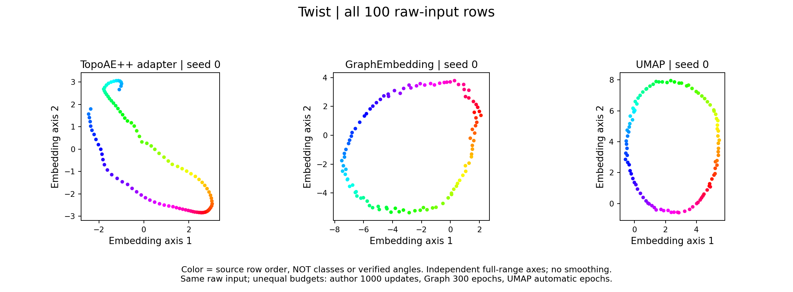
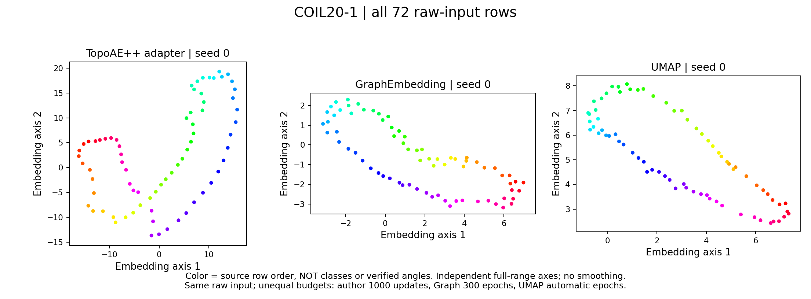
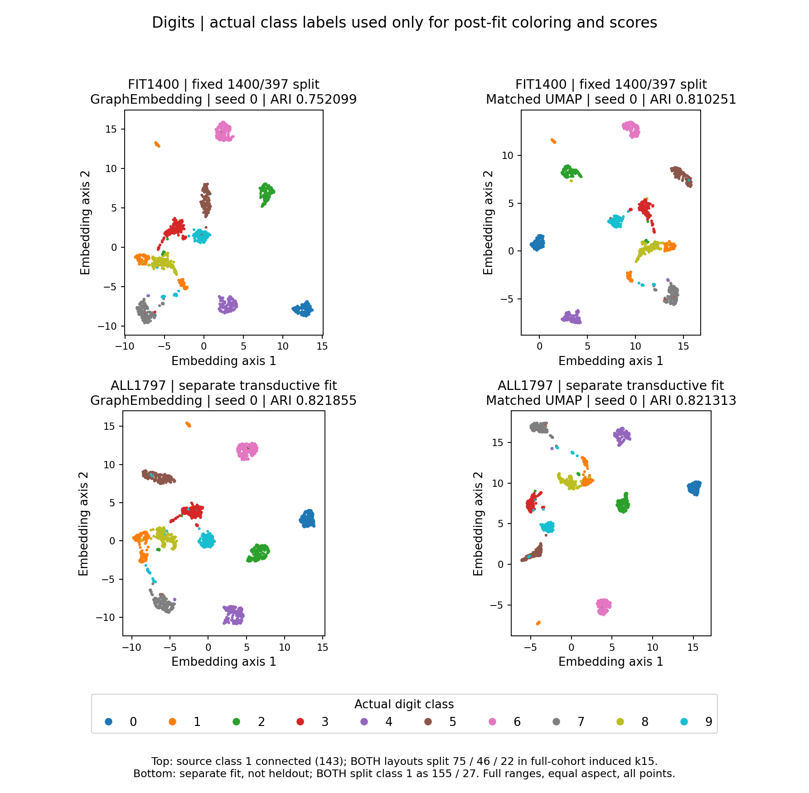

# Reviewed visual and structural comparisons

**Status: evaluation evidence, not a new default or a universal improvement.**
These figures summarize frozen runs; preparing this page did not fit or tune any
model. The experimental objectives discussed below were **not promoted** into
`GraphEmbedding`. A later numerical fix or implementation change needs a new
record: the [bounded result summary](../results/visual_contracts.json) identifies
historical source versions by role and SHA256.

No raw datasets, coordinate arrays, models, execution logs, external source trees
or machine-local paths are published here. The PNGs are derived visualizations,
not downloadable embeddings. The [reproduction driver](reproduce_baselines.py)
requires separately supplied inputs and, for TopoAE++, an explicitly trusted
external CPU adapter. Ordinary tests use synthetic fixtures only.

## What the evidence does—and does not—show

- **K4:** local-neighbor quality can hide lost cycles. At the declared normalized
  lifetime threshold 0.25, the source and the single-seed author adapter have
  three H1 bars, current GraphEmbedding one, and UMAP zero. This is a useful
  structural diagnostic, **not proof of matched source classes**.
- **The stronger K4 gate rejects every saved target.** Three source-selected
  cycles are independent on a fixed raw-unit interval, but none of the targets
  preserves all three under that exact contract—including the single-seed
  author output. That does **not** establish a failure of the paper's different
  best-of-ten protocol or a universal promise attributed to its authors.
- **Digits:** matched UMAP has the same focal class-1 fragmentation as our graph
  layout. Its higher split-cohort clustering score does not repair that split.
  The unsuccessful candidate objectives below do not become accepted simply
  because a classifier, one barcode count, or one seed improves.

### K4: actual author-code adapter versus current graph layout and UMAP


### Twist



### COIL20-1



These are full-range, equal-aspect raw scatters, not smoothed generator drawings.
Each panel retains its own coordinate range. Hue denotes **source row order**,
not invented class labels, verified rotation angles or persistence-generator
identity. COIL20-1 is the author's 72-row, 1024-feature single-object input—not
our separate 20-object/PCA64 task. A visible loop is not itself a certificate.

For the authors' own presentation, see the
[paper](https://arxiv.org/abs/2502.20215),
[official repository](https://github.com/mclemot/TopologicalAutoencodersPlusPlus),
[official rendering script](https://github.com/mclemot/TopologicalAutoencodersPlusPlus/blob/03f941d97305dbc045af7f595b6c5a3388808af2/scripts/Figure.py),
and [TTK example](https://topology-tool-kit.github.io/examples/topoAEppTeaser/).
Those are **reference figures**, separate from our actual adapter outputs above.
The official script draws persistence-generator overlays; our scatters receive
no smoothing or curve-overlay credit.

## Exact author-data protocol

External source pin: **`03f941d97305dbc045af7f595b6c5a3388808af2`**.

| Input | All rows × features | Headers and selected features |
|---|---:|---|
| 3Clusters | 800 × 3 | Header; `x,y,z`; `ClusterId` excluded from optimization |
| Twist | 100 × 3 | No header; columns 0,1,2; retain the first data row |
| K4 | 300 × 3 | No header; columns 0,1,2; retain the first data row |
| COIL20-1 | 72 × 1024 | Header names `1` through `1024`; exclude `1025` |
| Digits, separate generic comparison | 1797 × 64 | Raw sklearn 8×8 pixel features; target excluded |

All selected author features retain original row order with no scaling, PCA or
subsampling. COIL column `1025` is constant 1 in the pinned input. The author's
TTK branch excludes it, whereas its sklearn branch includes it; our controls
explicitly use the same 1024 selected features as the adapter. No semantic label
is inferred from that numeric header. MoCap and SingleCell were not fitted in
this bounded author baseline.

The external adapter invokes unchanged author `AutoEncoder` and
`TopologicalLoss(ASYMMETRIC_CASCADE)`, with an original standalone call site:

- full-batch CPU, one numerical thread, fixed seed **0**, 1,000 requested updates;
- encoder widths `d–128–32–2`, reverse decoder, ReLU and BatchNorm;
- Adam learning rate 0.01, betas (0.9,0.999), epsilon 1e-8, no weight decay;
- mean reconstruction MSE plus **0.01 × author topology loss**;
- original double-precision points for source pairing, float32 neural tensors;
- **training-mode final full-cloud encode**, matching the inspected author loop;
  silently switching to evaluation-mode BatchNorm would change this protocol;
- no ParaView, CUDA or CGAL; compatibility includes and standalone build are
  disclosed adaptations, not an untouched paper reproduction.

The official `Compute.py` performs **10 trials and selects minimum W1**. Here
there is **one fixed seed, no best-run selection and no real-fit retries**.
The additional preregistered 150-second per-case cap stopped 3Clusters after
**427/1000** updates and Digits during source persistence (**0 updates**).
Twist, K4 and COIL20-1 completed 1,000 updates each. Missing author outputs remain
missing: no partial embedding or proxy is published as a completed result.

Author-data controls use sklearn PCA2; genuine umap-learn with
`n_neighbors=15,min_dist=0.1,random_state=0` and otherwise its defaults; and the
historical GraphEmbedding defaults (exact source15, 300 epochs, 5 negatives,
seed0). Compute is unequal. An optional-TensorFlow import failure required one
recorded **import-only synthetic-preflight repair**; it was not a real-data retry
or a change to UMAP's nonparametric implementation.

### Recorded environment and source roles

The historical environment used Python 3.9.16, NumPy 1.21.6, SciPy 1.10.1,
scikit-learn 1.0.2, umap-learn 0.5.3, pynndescent 0.5.13, Numba 0.55.0,
llvmlite 0.38.0, CPU LibTorch 2.7.1, Boost 1.74 and AppleClang/C++17.
Independent PH diagnostics used Ripser.py 0.6.15 and persim 0.3.8.
These differ from the paper's documented LibTorch 2.4.0/CUDA environment.
Version matching does not remove platform, tie-ordering or stochastic differences.

The JSON records hashes for external model/loss/PH roles, author scripts,
selected input files and historical local graph code. Important script hashes:

| External role | SHA256 |
|---|---|
| `scripts/Compute.py` | `333538490753ba310b6b43eb33f35df2b490f02b5ac8362baca8c14795677d8c` |
| `scripts/Figure.py` | `d2e5784d3de53855df7b4bd0bc577fd2fd2063406e3b8a3a05bbad225866cd3b` |

A binary SHA is machine/build-specific; it is not a portable promise that another
build will be numerically identical. No author implementation is redistributed.

## Digits: matched support, not a classification substitute



The fixed split is `default_rng(0).permutation(1797)`: first 1,400 fit, remaining
397 held out. A separate all-1,797 fit is **transductive**, not held-out validation.
No labels enter fitting, graph construction, stopping or parameter selection.
Post-fit KMeans uses 10 clusters, seed0 and `n_init=20`; these clustering probes
are secondary diagnostics, not optimization targets or semantic guarantees.

| Frozen seed0 cohort | GraphEmbedding ARI | Matched UMAP ARI |
|---|---:|---:|
| Fit1400 | 0.7521 | 0.8103 |
| Held-out397, query-only clustering | 0.7637 | 0.8179 |
| Combined1797 inductive | 0.7532 | 0.8118 |
| Separate transductive1797 | 0.8219 | 0.8213 |

Matched Digits UMAP uses the **same exact 15 nonself neighbor IDs plus self**,
`n_neighbors=16`, 300 epochs, 5 negatives, min_dist0.1, spread1, spectral init,
seed0, a genuine NNDescent31 query index and forced approximation to retain the
supplied support. Its affinities, kernel, schedule and transform remain
**author-native**, not equated to ours. This is distinct from the default-UMAP
protocol used for the author-data figures above; their numbers are not pooled.

Class1's source-induced full-cohort k15 graph is connected with 143 fit points.
**Both nonlinear target layouts split it 75/46/22.** The separate transductive
source class has182 points and both targets split it155/27. These component
sizes come from the class-induced portion of the full-cohort graph, not a new
within-class neighbor search. Labels identify this post-fit diagnostic only.
Repeatedly visited source bridges still stretch; the evidence does not support
a simple “weak edges were never sampled” explanation. Source bottlenecks,
spectral initialization and local attraction/repulsion all matter. High-D
query-classification accuracy is **not an acceptance criterion** here.

## Rejected candidates: all outcomes retained

| Candidate | Reviewed outcome | Status |
|---|---|---|
| Multiscale log-distance continuation | Fit ARI0.7521→0.1416, overlap15 0.5534→0.0361; transductive ARI0.8219→0.1368; iteration cap reached in the latter | Catastrophic local/clustering damage; rejected |
| Nonvanishing linear attractive tail | Seed0 development gains did not generalize consistently: **1 of 4** new-seed/cohort ARI comparisons improved; all four lose silhouette, overlap15 and trustworthiness | No promotion; seeds1 and2, not “seed4” |
| Linear-tail Fashion transfer | ARI0.4231→0.4274, but NMI0.6149→0.5888, silhouette0.1729→0.1686 and sampled overlap15 0.1702→0.1574 | Mixed/negative transfer, not a universal gain |
| Source-critical/cascade distance stress | K4 small selected-edge stress does not preserve the three exact source classes; adding dynamic MST does not fix the strict gate | Oracle-assisted diagnostic only; rejected as a default |
| Adaptive target-H1 stress | K4 recovers a three-bar count at0.25, not the source lifetime profile or exact same-source-class contract; COIL target oracle times out after14 completed outer rounds | Partial evidence with failure; no promotion |

The Fashion transfer uses 50,000 training rows with previously training-fitted
PCA features, not official-test evaluation. KMeans covers all 50,000 rows;
overlap uses 512 fixed queries against all fitting rows and silhouette uses
2,048 fixed points. Its slight ARI increase does not cancel the other declines.

The new-seed tail comparisons are split1400 and transductive1797 at seeds1/2,
not four independent datasets. All source-scale Betti-discrepancy comparisons
worsen in those four pairs. Some author-input geometry transfers improve and
others worsen; neither larger holes nor better ARI proves source-cycle matching.
The tail intervention also reassociates floating arithmetic and omits a
production event-budget abort, so it is not claimed to be bitwise isolated.

The cascade tests use **author-exported source critical edges**, and the full
adaptive variant calls the author target oracle. They are not an independently
implemented TopoAE++ kernel. Eight arms complete20 outer rounds, one fails after14;
138 of174 completed inner rounds do not meet L-BFGS convergence criteria.
Coincident-point and exact-square oracle probes expose additional bounded
failures. A pre-data macOS resource-limit portability repair was recorded; no
hard RSS limit is claimed. None of these failures is removed from the summary.

## Exact same-source-cycle gate

Three longest **source-only** Ripser bars propose a common interior interval
`[0.23680398464202881, 0.5310013934969902]`. Their cochains annihilate all
**158,561** full-source survival triangles. A global source-MST fundamental-cycle
basis supplies three deterministic representatives with invertible cochain
pairing; two independent F2 reductions confirm source rank3.

The **same original-ID chains**, all300 vertices, original raw coordinate units
and fixed interval are then used for every target—no target-based representative
selection or rescaling. Here `graph_init` is the diagnostic experiment's saved
initializer, centered and source-distance-LS-scaled **once before optimization**;
it is not the unscaled GraphEmbedding panel above. No further target scale is
chosen for this gate; the author baseline is its actual unchanged output.
Eligible surviving rank is0 for graph initialization, source-only, adaptive-MST,
adaptive-full and the actual single-seed author baseline. Adaptive-full has two birth-present cycles filled by the endpoint;
the third survives there but one edge exceeds the required birth radius.
The author output likewise fails the birth condition despite an endpoint class.

This rejects **that explicit selected-family/raw-scale contract**, not every
possible topology notion or the authors' best-of-ten paper result. Conversely,
three bars at a selected normalized threshold cannot be substituted for this
failed same-class test. Optional unsmoothed representative overlays are geometric
diagnostics only; drawing a closed polygon earns no homology credit.

## Reproduction and publication boundary

Run `python benchmarks/visual_contracts/reproduce_baselines.py --help` for the
supported protocols and required external inputs. The driver is an opt-in local
runner, not a downloader, package installer, author-source vendor, sandbox, or
permission to redistribute input data. A supplied adapter is executable code:
review it and verify its checksum before opting in. No existing output is
silently overwritten, and a timeout/nonconvergence is not replaced with a proxy.

Supply your own external locations and a **new** output directory, for example:

```sh
# Validate only: no adapter execution or model fits.
python benchmarks/visual_contracts/reproduce_baselines.py \
  --upstream "$UPSTREAM" --data-dir "$DATA_DIR" \
  --dataset K4 Twist COIL20-1 \
  --methods PCA UMAP GraphEmbedding AUTHOR \
  --cpu-adapter "$CPU_ADAPTER" --adapter-sha256 "$ADAPTER_SHA256" \
  --adapter-manifest "$ADAPTER_MANIFEST" \
  --output "$NEW_CHECK_OUTPUT" --check-only

# Opt-in matched Digits controls; not the default-UMAP author-data protocol.
python benchmarks/visual_contracts/reproduce_baselines.py \
  --upstream "$UPSTREAM" --dataset Digits --protocol digits-matched \
  --methods PCA UMAP GraphEmbedding --output "$NEW_DIGITS_OUTPUT"
```

The pinned, clean external checkout is required in both modes. CSV hashes and
selected feature hashes are checked; Digits uses the already installed sklearn
bundle with verified bytes, not a download. `--check-only` creates local input
and registration artifacts, so a later fit needs a **different fresh output**.
To run the author-data case, repeat its command without `--check-only` and use
another new directory. No real fits were performed when validating this driver.

The full adapter manifest template is printed by `--help`: it binds the supplied
native binary checksum, generic dimensions, CPU/thread settings, model/loss,
seed, optimizer and training-mode output contract. Review the executable; a
manifest declaration cannot prove its behavior. No adapter binary or external
author build is distributed. Successful author output additionally requires an
ordered 1,000-step event stream, a completion event and finite exact-size output.
Each child is bounded to150 seconds, with900 seconds total and no retries.

Matched mode emits the split1400/query397 and separate transductive1797
coordinates, with author-native UMAP transformation and the current graph mapper.
The driver freezes actual installed code/dependency hashes before fitting. It
does **not** reproduce rejected experimental objectives, emit scores/figures, or
promise historical bitwise equality after a core/dependency change.

Keep generated features, coordinates, local logs and models outside the source
tree. The published JSON contains bounded configuration/outcome summaries and
hashes, not those payloads. Publication tests check schema, required negative
outcomes, path/payload boundaries and parser fixtures without real data or an
external executable. Updating the historical evidence requires a separately
reviewed export, not rerunning into the same record.

### Attribution and rights

Cite [TopoAE++](https://arxiv.org/abs/2502.20215),
[TTK](https://topology-tool-kit.github.io/publications.html),
[UMAP](https://arxiv.org/abs/1802.03426), and the applicable dataset sources.
Digits derives from sklearn's bundled optical-recognition dataset; COIL-20 is
Nene, Nayar and Murase (1996), CUCS-005-96, Columbia CAVE. Dataset/source access is
not an MIT or commercial redistribution grant. Original photographs, dataset
arrays and linked author binaries are not included. See the repository's
[third-party notices](../../THIRD_PARTY_NOTICES.md).

**TTK acknowledgment:** This document includes materials generated with TTK
(the Topology ToolKit) which is developed by the CNRS & Sorbonne Universite and
its contributors.
